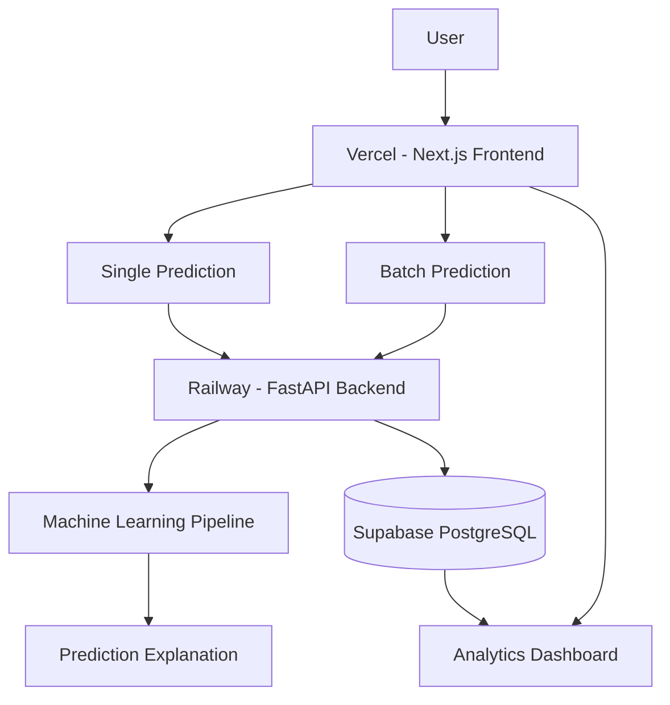

# Customer Churn Prediction & Explainable ML Platform

A full-stack machine learning web application for predicting telecom customer churn risk, explaining individual predictions, supporting batch customer prediction, and monitoring prediction analytics.

The platform integrates a **Next.js frontend**, **FastAPI backend**, **machine learning prediction pipeline**, **Supabase PostgreSQL database**, **Railway deployment**, and **Vercel deployment**.

---

## Live Application

### Frontend
https://customer-churn-ml-platform.vercel.app

### Predict Customer Churn
https://customer-churn-ml-platform.vercel.app/predict

### Batch Prediction
https://customer-churn-ml-platform.vercel.app/batch

### Analytics Dashboard
https://customer-churn-ml-platform.vercel.app/analytics

### Backend API
https://backend-production-0837.up.railway.app

### Interactive API Documentation
https://backend-production-0837.up.railway.app/docs

---

## Project Overview

Customer churn is an important business problem for subscription-based
organizations because losing existing customers can directly affect
revenue and long-term customer value.

This project provides an end-to-end churn intelligence platform capable
of:

- Predicting churn for an individual customer
- Estimating churn probability
- Assigning customer risk levels
- Explaining important factors behind predictions
- Processing multiple customers through batch prediction
- Storing prediction history
- Providing analytics based on historical predictions

The project demonstrates the complete workflow from machine learning
development to production deployment.

---

## Key Features

- Customer churn prediction using a trained machine learning model
- Churn probability estimation
- Low, Medium, and High customer risk classification
- Explainable prediction factors
- Single-customer prediction form
- CSV-based batch prediction
- Batch processing for large customer lists
- Prediction history persistence
- Analytics dashboard
- Average churn probability monitoring
- High-risk customer monitoring
- Risk distribution visualization
- Recent prediction history
- Responsive Next.js frontend
- FastAPI REST backend
- Supabase PostgreSQL integration
- Production deployment using Railway and Vercel

---

## System Architecture



### Production Flow

```text
User
  |
  v
Next.js Frontend - Vercel
  |
  v
FastAPI Backend - Railway
  |
  v
Machine Learning Model
  |
  +------> Prediction + Risk + Explanation
  |
  v
Supabase PostgreSQL
  |
  v
Analytics Dashboard
```

---

## Technology Stack

### Machine Learning

- Python
- pandas
- NumPy
- scikit-learn
- XGBoost-compatible pipeline
- SHAP-compatible explainability
- imbalanced-learn
- joblib

### Backend

- FastAPI
- Pydantic
- Uvicorn
- Supabase Python Client

### Frontend

- Next.js
- React
- TypeScript
- Tailwind CSS

### Database

- Supabase
- PostgreSQL

### Deployment

- Vercel — Frontend
- Railway — Backend
- Supabase — Database

### Version Control

- Git
- GitHub

---

## Dataset

The machine learning pipeline is based on the schema of the
**IBM Telco Customer Churn Dataset**.

The dataset contains customer information related to:

- Demographics
- Customer tenure
- Phone services
- Internet services
- Online security
- Online backup
- Device protection
- Technical support
- Streaming services
- Contract type
- Billing preferences
- Payment method
- Monthly charges
- Total charges
- Customer churn

The model does not use customer identifiers as predictive features.

---

## Input Features

The production prediction system accepts the following customer features:

| Feature | Description |
|---|---|
| tenure | Number of months the customer has stayed |
| gender | Customer gender |
| SeniorCitizen | Senior citizen status |
| Partner | Whether the customer has a partner |
| Dependents | Whether the customer has dependents |
| PhoneService | Phone service status |
| MultipleLines | Multiple phone lines |
| InternetService | Internet service type |
| OnlineSecurity | Online security service |
| OnlineBackup | Online backup service |
| DeviceProtection | Device protection service |
| TechSupport | Technical support service |
| StreamingTV | Streaming TV service |
| StreamingMovies | Streaming movie service |
| Contract | Contract type |
| PaperlessBilling | Paperless billing status |
| PaymentMethod | Payment method |
| MonthlyCharges | Monthly customer charge |
| TotalCharges | Total customer charges |

An optional `customer_reference` can be supplied to identify prediction
records without using it as an ML feature.

---

## Machine Learning Pipeline

The project uses a leakage-safe scikit-learn preprocessing and modeling
workflow.

Main preprocessing steps include:

- Removing customer identifiers from model features
- Converting `TotalCharges` to numeric format
- Handling missing values
- Treating categorical variables appropriately
- One-hot encoding categorical variables
- Scaling numeric variables
- Performing preprocessing inside the ML pipeline

This helps prevent information leakage between training and evaluation
data.

---

## Model Development

Multiple machine learning algorithms were considered during model
development, including:

- Logistic Regression
- K-Nearest Neighbors
- Support Vector Machine
- Decision Tree
- Random Forest
- Boosting / XGBoost-compatible modeling

Model selection was performed using stratified cross-validation and
ROC-AUC-based comparison.

The selected model is stored as a reusable model artifact and loaded by
the production FastAPI service.

---

## Decision Threshold

Instead of automatically relying only on the default probability
threshold, threshold analysis was performed using training-data
predictions.

The objective was to obtain an appropriate balance between identifying
customers likely to churn and limiting unnecessary retention
interventions.

The production model returns:

- Prediction
- Churn probability
- Risk level
- Explanation factors
- Model version

---

## Explainable AI

The application is designed to provide more than a binary churn
prediction.

For individual predictions, the system can expose important factors
associated with the prediction and whether they increase or decrease
estimated churn risk.

Explainability support includes SHAP-compatible and sklearn-based
fallback approaches depending on the model/runtime environment.

Predictions should be interpreted as statistical associations learned
from historical data rather than causal conclusions.

---

## Single Customer Prediction

Users can enter customer information through the web interface.

The frontend sends the customer information to:

```text
POST /predict
```

The backend:

1. Validates the request
2. Preprocesses customer features
3. Runs ML inference
4. Calculates churn probability
5. Determines the risk level
6. Generates explanation factors
7. Stores the prediction in Supabase
8. Returns the result to the frontend

---

## Batch Customer Prediction

The platform supports CSV-based batch prediction.

Users can upload a CSV containing multiple customers through:

```text
/batch
```

The frontend validates and transforms the uploaded customer records and
sends them to the batch API.

Backend endpoint:

```text
POST /predict-batch
```

The backend processes each customer, generates predictions, and stores
successful prediction records in Supabase.

The current backend limits an individual batch API request to a maximum
of **500 customers**. The frontend can divide uploaded records into
smaller request chunks for processing.

---

## Required Batch CSV Columns

```text
customer_reference
tenure
gender
senior_citizen
partner
dependents
phone_service
multiple_lines
internet_service
online_security
online_backup
device_protection
tech_support
streaming_tv
streaming_movies
contract
paperless_billing
payment_method
monthly_charges
total_charges
```

The frontend converts the CSV field names into the field aliases expected
by the backend prediction schema.

---

## Analytics Dashboard

The Analytics Dashboard summarizes stored prediction history from
Supabase.

It provides:

- Total predictions
- Average churn probability
- High-risk customer count
- Risk distribution
- Recent predictions

The analytics data loader uses server-side access to Supabase, keeping
the service-role credential outside the browser.

Prediction records are retrieved in paginated batches so analytics are
not restricted to only the latest 200 records.

---

## Prediction Database

Prediction history is stored in the Supabase PostgreSQL table:

```text
prediction_history
```

Stored information includes:

- Customer reference
- Prediction
- Churn probability
- Risk level
- Model version
- Prediction timestamp

The customer reference is used for record identification and is not
passed to the ML model as a predictive feature.

---

## FastAPI Endpoints

### Health Check

```http
GET /health
```

Checks whether the backend and prediction service are operational.

### Model Information

```http
GET /model-info
```

Returns information about the currently loaded ML model.

### Single Prediction

```http
POST /predict
```

Runs churn prediction for one customer.

### Batch Prediction

```http
POST /predict-batch
```

Runs churn predictions for multiple customers.

Interactive API documentation is available at:

https://backend-production-0837.up.railway.app/docs

---

## Frontend Pages

| Page | Route | Purpose |
|---|---|---|
| Overview | `/` | Project overview |
| Predict Churn | `/predict` | Single-customer prediction |
| Batch Upload | `/batch` | CSV batch prediction |
| Analytics | `/analytics` | Prediction analytics |
| Model Info | `/model` | Production model information |

The navigation bar provides access to all major application modules.

---

## Repository Structure

```text
customer-churn-ml-platform/
│
├── backend/
│   ├── app/
│   │   ├── main.py
│   │   ├── schemas.py
│   │   └── services/
│   ├── tests/
│   └── requirements.txt
│
├── frontend/
│   └── app/
│       ├── analytics/
│       ├── batch/
│       ├── model/
│       ├── predict/
│       ├── layout.tsx
│       └── page.tsx
│
├── ml/
│   ├── artifacts/
│   ├── train.py
│   ├── evaluate.py
│   ├── explain.py
│   └── eda.py
│
├── data/
│   └── raw/
│
├── database/
│   └── migrations/
│
├── reports/
│   ├── figures/
│   └── results/
│
├── tests/
│
├── .env.example
└── README.md
```

---

## Local Development

### Clone Repository

```bash
git clone https://github.com/the-nishi/customer-churn-ml-platform.git
cd customer-churn-ml-platform
```

### Backend

```bash
cd backend
pip install -r requirements.txt
uvicorn app.main:app --reload --port 8000
```

Backend development URL:

```text
http://localhost:8000
```

API documentation:

```text
http://localhost:8000/docs
```

---

## Frontend

```bash
cd frontend
npm install
npm run dev
```

Frontend development URL:

```text
http://localhost:3000
```

---

## Environment Variables

### Frontend

```env
NEXT_PUBLIC_API_URL=http://localhost:8000

SUPABASE_URL=your_supabase_project_url
SUPABASE_SERVICE_ROLE_KEY=your_supabase_service_role_key
```

### Backend

```env
FRONTEND_ORIGINS=http://localhost:3000
SUPABASE_URL=your_supabase_project_url
SUPABASE_SERVICE_ROLE_KEY=your_supabase_service_role_key
```

Never commit production credentials or service-role keys to GitHub.

---

## Deployment Architecture

### Frontend — Vercel

The Next.js frontend is deployed on Vercel.

Production frontend:

https://customer-churn-ml-platform.vercel.app

The Vercel project uses:

```text
Root Directory: frontend
```

---

### Backend — Railway

The FastAPI backend is deployed on Railway.

Production backend:

https://backend-production-0837.up.railway.app

Railway configuration:

```text
Root Directory: backend
Build Command: pip install -r requirements.txt
Start Command: uvicorn app.main:app --host 0.0.0.0 --port $PORT
Health Check: /health
```

---

### Database — Supabase

Supabase PostgreSQL stores production prediction history.

The backend uses server-side credentials to persist prediction results.

The Next.js Analytics server component accesses prediction data
server-side so sensitive credentials are not exposed to client-side
JavaScript.

---

## Production Status

The core end-to-end system is operational.

```text
Single Prediction
       ↓
FastAPI ML Inference
       ↓
Prediction Result
       ↓
Supabase Persistence
       ↓
Analytics Dashboard
```

and:

```text
CSV Upload
    ↓
Batch Prediction
    ↓
FastAPI ML Inference
    ↓
Supabase Persistence
    ↓
Analytics Dashboard
```

The following production components have been integrated:

- Vercel frontend
- Railway FastAPI backend
- ML model inference
- Single-customer prediction
- Batch customer prediction
- Supabase prediction persistence
- Analytics dashboard
- Model information endpoint
- Interactive FastAPI documentation

---

## Security Considerations

- Supabase service-role credentials remain server-side
- Environment variables are used for secrets
- Customer reference is excluded from ML features
- API requests are validated using Pydantic
- CORS is configurable through environment variables
- Production credentials are not stored in the repository

---

## Ethical Considerations

Customer churn predictions are probabilistic estimates based on patterns
learned from historical data.

They should support business decision-making rather than be interpreted
as guaranteed outcomes or causal conclusions.

Organizations using churn prediction systems should also consider data
quality, fairness, model drift, customer privacy, and appropriate human
oversight when making retention decisions.

---

## Current Limitations

- Model performance depends on the quality and representativeness of the
  training dataset.
- Prediction explanations represent model associations, not causal
  relationships.
- Authentication and role-based access control are not currently
  implemented for the analytics dashboard.
- Very large production-scale analytics workloads would benefit from
  database-side aggregation rather than retrieving all prediction rows.
- Production ML systems should periodically monitor model drift and
  retrain the model when appropriate.

---

## Future Improvements

Potential extensions include:

- Authentication and role-based access control
- Model drift monitoring
- Automated model retraining
- CI/CD testing with GitHub Actions
- Database-side analytics aggregation
- Advanced SHAP visualizations
- Customer segmentation
- Retention recommendation engine
- Exportable analytics reports
- Batch job history and downloadable results

---

## GitHub Repository

https://github.com/the-nishi/customer-churn-ml-platform

---

## Project Status

**Production-deployed and operational.**

The application currently supports end-to-end single prediction, batch
prediction, prediction persistence, explainability, and analytics through
a deployed full-stack ML architecture.

---

## Disclaimer

This project is intended for machine learning demonstration, research,
education, and portfolio purposes.

Predictions represent statistical estimates and should not be treated as
guaranteed customer outcomes.
