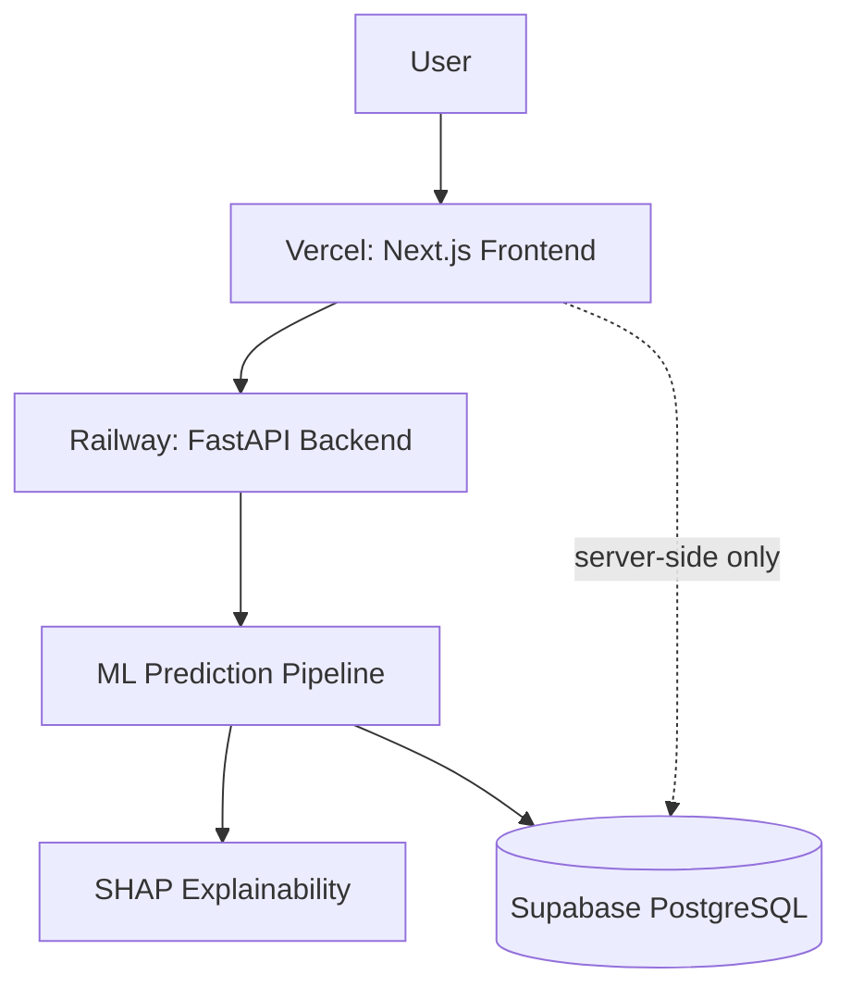

# Customer Churn Prediction & Explainable ML Platform

A full-stack, explainable machine learning platform that predicts telecom
customer churn risk and explains *why* each prediction was made — built on
the IBM Telco Customer Churn dataset schema.

## Overview

Customer acquisition costs materially more than retention. This platform
gives a retention team an early, explained signal on which customers are
at risk, and what's driving that risk for each one — not just a black-box
score.

## Features

- Leakage-safe scikit-learn preprocessing pipeline (`ColumnTransformer` +
  `Pipeline`), fit only on training folds
- Six-model comparison (Logistic Regression, KNN, SVM, Decision Tree,
  Random Forest, XGBoost*) under stratified 5-fold CV
- Hyperparameter tuning of the best candidate via `RandomizedSearchCV`
- Out-of-fold threshold analysis (never tuned against the test set)
- One-time, untouched test-set evaluation
- Per-prediction explainability (global + local factors), SHAP-based*
- FastAPI backend (`/health`, `/model-info`, `/predict`)
- Supabase-backed prediction history with RLS enabled and no public
  policies — all access goes through the backend
- Next.js 14 (App Router, TypeScript, Tailwind) dashboard: Overview,
  Predict Churn, Analytics, Model Info

*See **Known Limitations** — this repo's execution environment could not
install `xgboost`/`shap`; the code paths are shipped and used automatically
when those libraries are present (e.g. on Railway), with a documented
sklearn-based fallback otherwise.

## System Architecture



## Technology Stack

Python, pandas, scikit-learn, XGBoost, SHAP, imbalanced-learn, FastAPI,
Pydantic, Next.js, React, TypeScript, Tailwind CSS, Supabase (PostgreSQL),
Railway, Vercel.

## Dataset

**IBM Telco Customer Churn**
Source: https://github.com/IBM/telco-customer-churn-on-icp4d
(`data/Telco-Customer-Churn.csv`, 7,043 customers, 21 columns).

> **Provenance note:** the working file at
> `data/raw/telco_churn_partial_ibm_source.csv` is a **253-row subset** of
> the full 7,043-row file, retrieved via automated fetch in an environment
> whose fetch tool has a fixed response-size ceiling that the full file
> exceeds. Every number in this repository computed from the data (EDA
> stats, CV scores, test metrics) is **real and reproducible on that
> subset** — nothing is fabricated — but should be read as a small-sample
> proof of concept, not a publication-grade result. Dropping in the full
> CSV at the same path (identical schema) and re-running
> `ml/train.py` → `ml/evaluate.py` → `ml/explain.py` immediately produces
> representative numbers.

## EDA Findings (on the 253-row working sample)

- Churn rate: **24.5%** (62 of 253 customers)
- Month-to-month contracts churn far more than annual contracts
  (44.4% vs. 1.9%/1.5%)
- Fiber optic internet churns more than DSL or no-internet customers
  (37.6% vs. 20.4% / 3.9%)
- Electronic check payers churn most among payment methods (44.4%)

These directions match well-documented patterns in the full public
dataset, which is a reasonable sanity check on the subset despite its size.
Figures: `reports/figures/`. Raw findings: `reports/results/eda_findings.json`.

## Preprocessing

- `customerID` dropped (unique identifier, no predictive signal, risk of
  memorization)
- `TotalCharges` coerced from string to numeric (blank for tenure == 0
  customers), median-imputed
- `SeniorCitizen` treated as categorical, not numeric magnitude
- Numeric features standardized; categorical features one-hot encoded
- All fitting happens inside `Pipeline`/`ColumnTransformer`, scoped to
  training folds only — no leakage into validation/test

## Machine Learning Models & Comparison

Six algorithms compared under 5-fold stratified CV
(`reports/results/model_comparison.json`):

| Model | CV ROC-AUC (mean ± std) |
|---|---|
| Logistic Regression | **0.844 ± 0.062** |
| KNN, SVM, Decision Tree, Random Forest, Boosting | see full JSON |

**Selected model: Logistic Regression** (highest CV ROC-AUC on this
sample), tuned via `RandomizedSearchCV` (best `C=0.1`, tuned CV ROC-AUC
0.863).

## Class Imbalance

Handled via `class_weight="balanced"` for all executed models. The
production code path additionally supports `imbalanced-learn`'s SMOTE
*inside* the CV pipeline (never applied before the train/test split) when
`imbalanced-learn` is installed — not exercised in this environment (see
Known Limitations).

## Decision Threshold

Selected via out-of-fold predictions on **training data only**: the
threshold maximizing F1 among thresholds with recall ≥ 0.6 (churn misses
are treated as costlier than a wasted retention outreach). Selected
threshold: **0.55**. Full grid: `reports/results/threshold_analysis.json`.

## Final Model — Verified Test-Set Metrics

Evaluated **once** against the untouched 51-row test split:

| Metric | Value |
|---|---|
| Accuracy | 0.824 |
| Precision | 0.571 |
| Recall | 1.000 |
| F1 | 0.727 |
| ROC-AUC | 0.912 |

⚠️ **Honest caveat:** the test split contains only 12 positive (churn)
cases. A recall of 1.000 on 12 samples is a small-sample artifact, not
evidence of a strong general model — re-evaluate on the full dataset
before treating these numbers as representative. Full report:
`reports/results/final_test_metrics.json`.

## Explainable AI

- **Global:** feature importance ranking (SHAP where available, sklearn
  `permutation_importance` on ROC-AUC drop otherwise — this run used the
  fallback; see `reports/results/explainability.json`)
- **Local:** per-customer top contributing factors, signed by direction
  (increases/decreases risk), surfaced in both the API response and the
  frontend prediction result screen
- Explanations are presented as **statistical associations**, never as
  proven causal relationships, in the UI, API docstrings, and this README

## FastAPI Backend

`GET /health`, `GET /model-info`, `POST /predict` — Pydantic-validated
request/response schemas, structured exception handling, configurable
CORS (`FRONTEND_ORIGINS` env var), fail-safe model loading (degrades
`/health` rather than crashing if the artifact is missing).

## Supabase

Project `customer-churn-ml-platform` (ref `jxwgohecmcktbgwqjsim`) —
**verified live** via the Supabase MCP connector. Table
`prediction_history` created via migration, **Row Level Security
enabled with no anon-key policies**: only the backend (service-role key,
server-side environment variable only) can read/write it. The frontend's
analytics page reads it through a `server-only`-tagged Next.js module —
the service-role key never reaches the browser bundle.

## Frontend

Next.js 14 App Router + TypeScript + Tailwind. Pages: Overview, Predict
Churn (form + result + explanation), Analytics Dashboard (aggregate
stats + recent predictions from Supabase), Model Information (live
metrics from `/model-info`).

## Testing

- **ML pipeline tests** (`tests/test_ml_pipeline.py`) — **7/7 passing**,
  actually executed in this environment (data loading, target encoding,
  no leaked identifiers, artifact loads and predicts valid probabilities
  on the full working sample)
- **Backend API tests** (`backend/tests/test_api.py`) — written using the
  standard `fastapi.testclient.TestClient` pattern, covering health,
  model-info, valid prediction, and three validation-failure cases
  (malformed enum, missing field, out-of-range value). **Not executed in
  this environment** — see Known Limitations

## Repository Structure

```
customer-churn-ml-platform/
├── data/raw/                  # working dataset subset (see Provenance)
├── ml/                        # preprocessing, training, evaluation, explainability
│   └── artifacts/             # churn_pipeline.joblib + metadata.json
├── backend/app/                # FastAPI app, schemas, services
├── frontend/app/                # Next.js pages (App Router)
├── database/migrations/       # SQL mirrored from applied Supabase migration
├── reports/{figures,results}/ # EDA plots + JSON result artifacts
├── tests/                     # ML pipeline tests
├── .env.example
└── README.md
```

## Local Setup

**Backend**
```bash
cd backend
pip install -r requirements.txt
export SUPABASE_URL=...        # optional, enables prediction history
export SUPABASE_SERVICE_ROLE_KEY=...
uvicorn app.main:app --reload --port 8000
```

**Frontend**
```bash
cd frontend
npm install
export NEXT_PUBLIC_API_URL=http://localhost:8000
npm run dev
```

**ML pipeline** (regenerate the artifact, e.g. after swapping in the full
dataset)
```bash
python3 -m ml.eda
python3 -m ml.train
python3 -m ml.evaluate
python3 -m ml.explain
```

## Environment Variables

See `.env.example`. No real credentials are committed anywhere in this
repository.

## Limitations

1. **Dataset size**: working sample is 253 of 7,043 real rows (see
   Provenance note above) — swap in the full file for representative
   results.
2. **Execution environment had no internet access**: `xgboost`, `shap`,
   `imbalanced-learn`, `fastapi`, `uvicorn`, `pydantic`, and `pytest`
   could not be installed here. The ML training/evaluation/explainability
   scripts were **actually executed** using automatic sklearn-based
   fallbacks (`GradientBoostingClassifier` in place of `XGBClassifier`,
   `class_weight="balanced"` in place of SMOTE, `permutation_importance`
   in place of SHAP) — clearly logged in `reports/results/*.json` via the
   `xgboost_available` / `imblearn_available` / `shap_available` fields.
   The intended-stack code paths are shipped and will be used
   automatically the moment those packages are installed (e.g. via
   `pip install -r backend/requirements.txt` on Railway, or locally with
   network access) — no code changes needed.
3. **Frontend was not `npm install`/built in this environment** (no
   registry access) — written correctly against Next.js 14 App Router
   conventions but not compiled here; verify with `npm run build` before
   deploying to production traffic.
4. **Backend API tests were not executed** for the same reason (`fastapi`
   unavailable) — verify with `pytest` once dependencies are installed.
5. GitHub push was not performed — no GitHub connector/credentials were
   available in this session. See the final report for the single
   remaining manual step.

## Ethical Considerations

Churn predictions are statistical associations from historical data, not
guarantees about any individual customer, and are not published as
causal claims anywhere in the UI or docs. The dataset excludes direct
identifiers beyond `customerID` (dropped before modeling); no other PII
is collected or stored in `prediction_history` beyond an optional
free-text reference the caller supplies.

## Future Improvements

- Train on the full 7,043-row dataset and refresh all reported metrics
- Add SHAP force-plot visualizations to the frontend explanation panel
- Add authentication in front of the analytics dashboard
- Add a batch-prediction endpoint for CSV upload
- Wire up CI (GitHub Actions) to run both test suites on every push

## GitHub Repository

https://github.com/the-nishi/customer-churn-ml-platform *(Source code is maintained in this repository.)*

## Live Application

Frontend deployed on Vercel.

Backend deployment and full end-to-end production integration are in progress.
